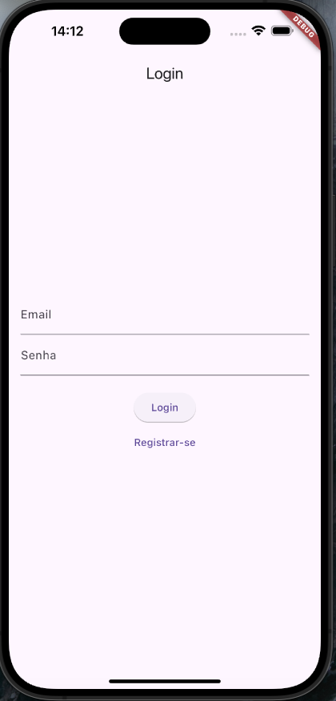
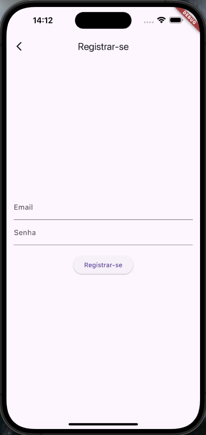
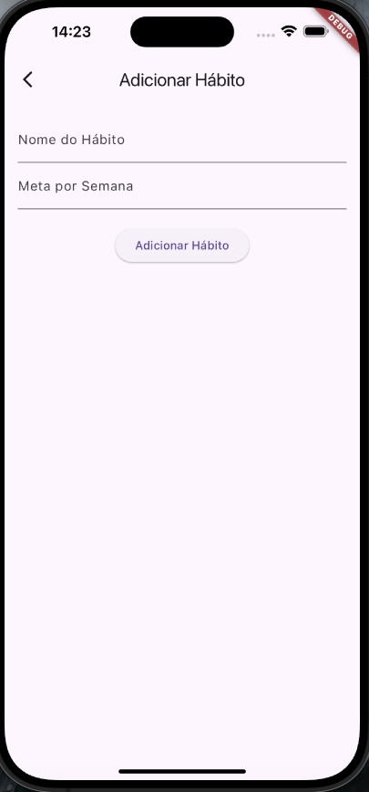

# Habit Tracker App

## v1. Primeira versão
- **Para a Documentação da primeira versão:**
[Clique aqui ](documents/versao1.md)

### v1. Funcionalidades Implementadas
- Autenticação de Usuários
- Gerenciamento Basico de Hábitos
- Listagem e Sincronização de Hábitos
- Adicionar Hábito
- Logout

### v1. Imagens

  
  

  
  

