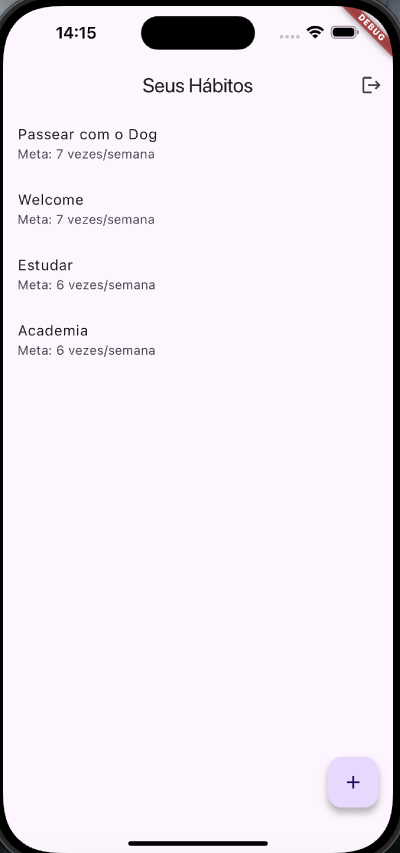
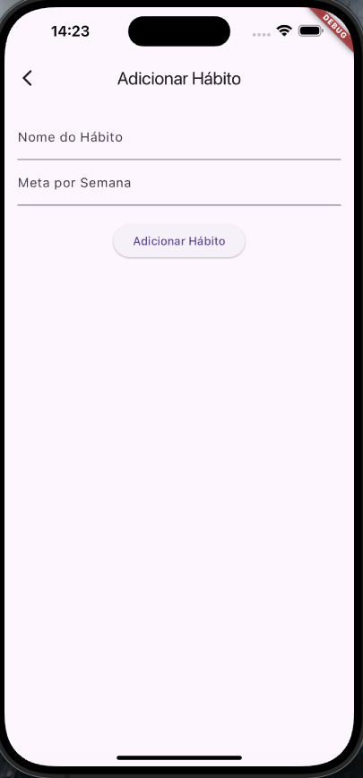

# Documentação da V1 - Aplicativo de Gestão de Hábitos

## 1. Introdução

O Aplicativo de Gestão de Hábitos foi desenvolvido para ajudar os usuários a acompanhar seus hábitos diários e metas semanais. Ele permite que os usuários registrem novos hábitos, acompanhem o progresso, e modifiquem ou excluam hábitos já existentes. Cada usuário possui sua própria lista de hábitos, garantida por um sistema de autenticação e armazenamento de dados em tempo real com o Firebase.

Esta é a versão 1 (V1) do aplicativo, com as principais funcionalidades implementadas para gerenciar os hábitos de forma personalizada e segura.

## Imagens 

<p align="center">
  
  
</p>

<p align="center">
  
  
</p>

<p align="center">
  
</p>


## 2. Funcionalidades Implementadas

### 2.1. Autenticação de Usuários

	•	O aplicativo utiliza Firebase Authentication para gerenciar a autenticação.
	•	Usuários podem fazer login com email e senha.
	•	Novos usuários podem se registrar diretamente pelo app.
	•	Após o login, os usuários são direcionados para sua própria lista de hábitos.

#### 2.2. Gerenciamento de Hábitos

	•	Cada usuário pode criar hábitos com um nome e meta semanal.
	•	Os hábitos são vinculados ao userId do usuário autenticado, garantindo que cada usuário veja apenas seus próprios hábitos.
	•	Os hábitos são armazenados no Firebase Firestore, e todas as alterações são refletidas em tempo real na interface do usuário.

#### 2.3. Listagem e Sincronização de Hábitos

	•	A tela principal do app exibe a lista de hábitos do usuário logado.
	•	A listagem é feita em tempo real com dados do Firestore, utilizando o StreamBuilder para refletir alterações instantaneamente.
	•	Se o usuário não tiver hábitos cadastrados, uma mensagem apropriada é exibida.

#### 2.4. Adicionar Hábito

	•	Os usuários podem adicionar novos hábitos clicando no botão “Adicionar” na tela principal.
	•	Um novo hábito inclui o nome, a meta semanal, e é automaticamente vinculado ao usuário autenticado (via userId).
	•	A criação de hábitos é feita através de um formulário simples.

#### 2.5. Logout

	•	O aplicativo inclui uma funcionalidade de logout, permitindo que os usuários façam logout de sua conta e entrem com outra.
	•	O botão de logout está localizado na tela principal, no canto superior direito.

## 3. Tecnologias Utilizadas

#### 3.1. Flutter

	•	O Flutter é utilizado para o desenvolvimento do aplicativo móvel, fornecendo uma interface responsiva e nativa tanto para iOS quanto para Android.

#### 3.2. Firebase Authentication

	•	O Firebase Authentication é utilizado para gerenciar o login e registro de usuários com email e senha.

#### 3.3. Firebase Firestore

	•	O Firebase Firestore é utilizado para armazenar e recuperar os hábitos em tempo real, associando-os ao userId de cada usuário.
	•	Todas as operações de leitura e escrita são feitas de forma segura com regras configuráveis.

## 4. Arquitetura do Aplicativo

#### 4.1. Model-View-ViewModel (MVVM)

O aplicativo segue a arquitetura MVVM para separar responsabilidades de forma clara:

	•	Model: Representa os dados do aplicativo. O modelo de Habit define as propriedades de cada hábito.
	•	ViewModel: Contém a lógica de negócio. O HabitViewModel gerencia a criação e recuperação de hábitos, além de se comunicar com o Firebase.
	•	View: A interface do usuário, representada pelas telas de login, lista de hábitos e adição de hábitos.

#### 4.2. Dependências

O arquivo pubspec.yaml inclui as seguintes dependências principais:
```
dependencies:
  flutter:
    sdk: flutter
  firebase_core: ^3.0.0
  firebase_auth: ^5.0.0
  cloud_firestore: ^5.0.0
```

## 5. Estrutura de Pastas

A estrutura de pastas do projeto está organizada da seguinte maneira:
```
lib/
 ├── models/         ## Contém o modelo Habit
 ├── viewmodels/     ## Lógica de negócio e interação com o Firestore
 ├── views/          ## Telas principais (Login, Lista de Hábitos, Adição de Hábitos)
 └── main.dart       ## Ponto de entrada do app
```

## 6. Fluxo do Aplicativo

	1.	Inicialização: O app verifica se há um usuário autenticado:
	•	Se houver, o usuário é redirecionado para a tela de lista de hábitos.
	•	Se não houver, o usuário vê a tela de login.
	2.	Login/Registro: O usuário pode fazer login ou criar uma nova conta.
	3.	Listagem de Hábitos: Após o login, a lista de hábitos do usuário logado é exibida, buscada do Firestore e vinculada ao userId.
	4.	Adicionar Hábito: O usuário pode criar novos hábitos que são automaticamente vinculados ao seu userId no Firestore.
	5.	Logout: O usuário pode fazer logout e voltar à tela de login.

## 7. Próximos Passos e Melhorias

A versão 1 (V1) do aplicativo já permite o gerenciamento básico de hábitos, mas melhorias e novas funcionalidades podem ser adicionadas nas próximas versões. Algumas ideias para futuras melhorias incluem:

    •   Acompanhar a rotina do usuario
    •   Criar a recorencia de habitos
	•	Editar e excluir hábitos.
	•	Gráficos de progresso para acompanhar a evolução dos hábitos.
	•	Notificações push para lembrar os usuários de seus hábitos diários.
	•	Customização das categorias de hábitos.
	•	Aprimorar a interface gráfica e responsividade.

Essa documentação cobre o estado atual do aplicativo na V1, e servirá de base para as melhorias e novos recursos que serão desenvolvidos nas próximas versões.

